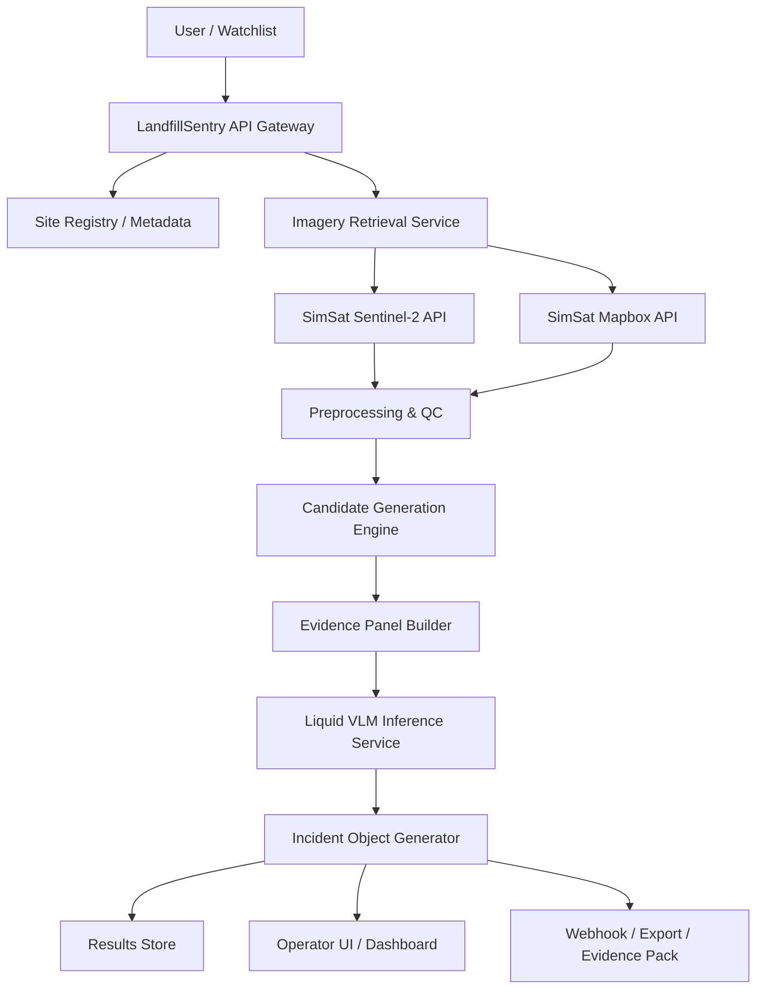
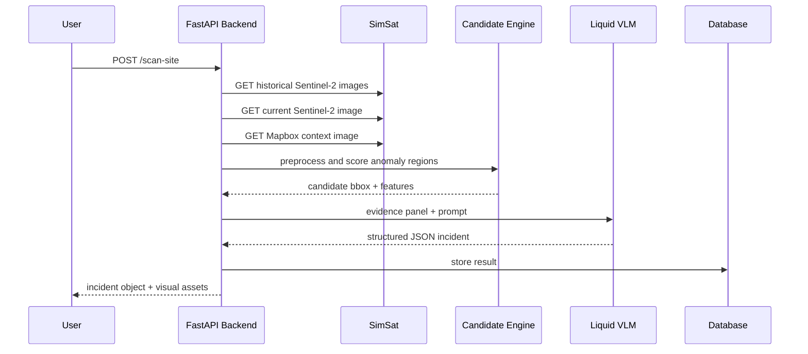
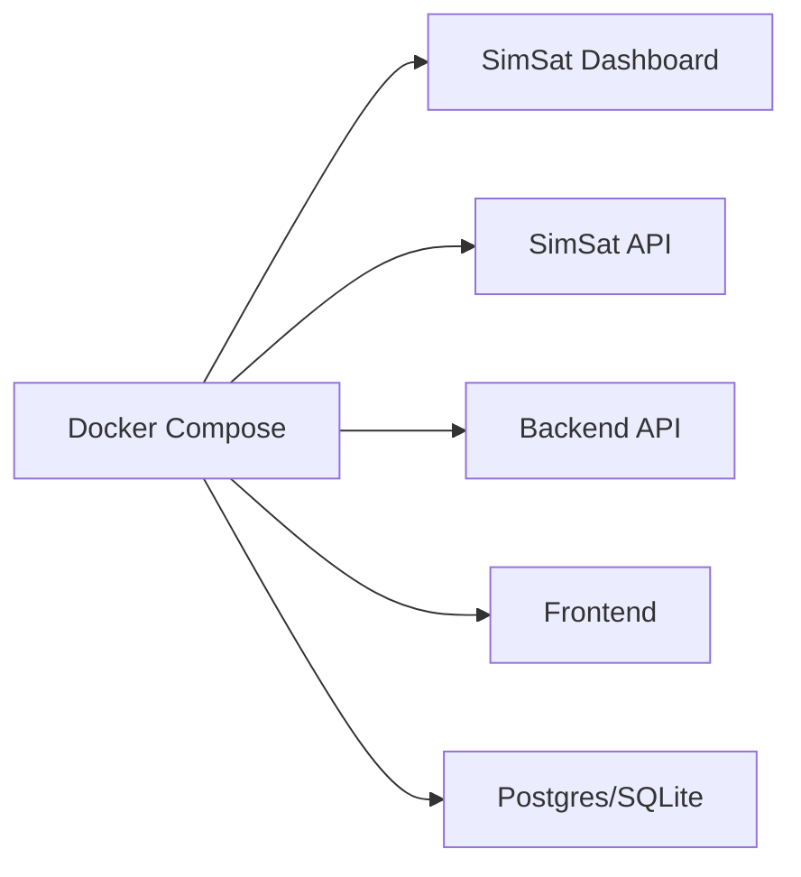

# LandfillSentry Ops  
## Detailed Product, Architecture, Data, API, and Execution Report  
### Version 1.0  
### Date: 19 April 2026

---

## Document Purpose

This document is a complete starter dossier for building **LandfillSentry Ops**, an operator-first landfill methane triage copilot for the Liquid AI x DPhi Space AI in Space Hackathon. It is written to be the single document a team can use to move from idea to implementation without needing a separate concept note, architecture memo, or initial build plan.

The report covers:

- problem framing and product thesis
- why this use case is a strong fit for the hackathon
- target users and buyer wedge
- detailed system architecture
- external APIs, datasets, and open-source frameworks
- internal API design
- model strategy and fine-tuning plan
- evaluation plan and success criteria
- deployment design
- security, risk, and failure modes
- implementation plan, sprint plan, and repository structure
- hackathon demo strategy
- roadmap beyond the hackathon

This document is intentionally detailed. It is optimized for execution, not just persuasion.

---

## Table of Contents

1. Executive Summary  
2. Why This Idea Wins the Hackathon  
3. Problem Definition  
4. Product Vision  
5. Users, Stakeholders, and Initial Buyer  
6. Why Landfill Methane Instead of Other Domains  
7. Solution Overview  
8. System Requirements  
9. High-Level Architecture  
10. Data Sources and External Systems  
11. External APIs and Frameworks Required  
12. Internal Service Design  
13. Detailed Data Flow  
14. Detection and Candidate Generation Pipeline  
15. Vision-Language Model Layer  
16. Fine-Tuning Strategy  
17. Dataset Strategy  
18. Prompting and Output Schemas  
19. Evaluation Plan  
20. Product UX and Demo Flow  
21. Backend API Specification  
22. Data Models  
23. Deployment and Infrastructure  
24. GPU and Training Plan  
25. Implementation Roadmap  
26. Repository Structure  
27. Engineering Work Breakdown  
28. Risks and Mitigations  
29. Stretch Features  
30. Submission Strategy  
31. Final Build Recommendation  
32. References  

---

## 1. Executive Summary

**LandfillSentry Ops** is an operator-first landfill methane triage copilot that turns multispectral satellite imagery into explainable incident alerts for landfill teams. The product scans landfill sites using **Sentinel-2** imagery retrieved through **SimSat**, uses temporal and spectral analysis to generate candidate methane-emission regions, grounds those candidates with **Mapbox** facility context imagery, and passes a compact evidence panel to a fine-tuned **Liquid AI LFM2.5-VL-450M** model. The model returns a structured incident object with:

- plume likely or not likely
- bounding box
- likely source zone
- persistence score
- evidence summary
- recommended inspection priority

The product is deliberately framed as a **triage and prioritization system**, not a final regulatory quantification engine. That framing is important both technically and strategically. It matches the strengths of the available sensor stack, aligns with what a small fine-tuned VLM can do well, and is more defensible within hackathon scope.

The core thesis is simple:

> Existing methane monitoring ecosystems increasingly detect and map methane events, but landfill operators still need a lightweight product that turns raw or semi-processed geospatial evidence into an actionable, facility-specific incident object.

That gap is where LandfillSentry Ops sits.

### Why this is a strong hackathon idea

This idea matches the Liquid Track unusually well:

1. **Use of satellite imagery is central, not decorative.**  
   The product depends on Sentinel-2 multispectral imagery for methane-sensitive analysis and on Mapbox imagery for facility context.

2. **Liquid’s VLM is not bolted on.**  
   The VLM is used for grounded interpretation, structured incident generation, evidence summarization, and operator guidance. LFM2.5-VL’s bounding-box capability is especially valuable here.

3. **There is a clean fine-tuning path.**  
   Liquid explicitly recommends fine-tuning LFM2.5-VL-450M for use-case-specific performance. Project Eucalyptus gives us a methane-domain bootstrapper with models, post-processing tooling, and synthetic plume generation.

4. **The problem is real and commercially believable.**  
   Waste-sector methane is large, actionable, and under-addressed relative to oil and gas. Multiple public initiatives now show operator, policy, and mitigation demand.

5. **The demo can be strong and clean.**  
   The system can be demonstrated end to end with a simple, memorable operator workflow.

### One-line pitch

**LandfillSentry Ops turns Sentinel-2 and Mapbox imagery into explainable methane incident alerts that tell landfill operators where to inspect first.**

---

## 2. Why This Idea Wins the Hackathon

The hackathon rewards four things:

- use of DPhi satellite imagery
- innovation and problem-solution fit
- technical implementation that runs cleanly
- demo clarity

This product scores well across all four.

### 2.1 Use of DPhi satellite imagery

SimSat provides current and historical access to Sentinel-2 and Mapbox imagery. Sentinel-2 is the main source for temporal and multispectral analysis, while Mapbox provides sharper RGB context for interpreting site structure and grounding operator actions. This is exactly the kind of combined imagery workflow the SimSat stack enables best.  
Source: [SimSat GitHub README](https://github.com/DPhi-Space/SimSat)

### 2.2 Innovation and problem-solution fit

A generic “satellite dashboard” is not enough. This product is more specific and therefore more compelling:

- it is focused on **landfills**, not all methane sources
- it is focused on **operations**, not generic environmental storytelling
- it returns a **developer-ready incident object**, not just a visualization
- it uses the VLM to produce **grounded interpretation**, not vague captioning

The combination of a methane-sensitive candidate-generation step plus a fine-tuned small VLM is also differentiated. The first stage handles spectral physics better than a generic VLM could. The second stage handles interpretation, ranking, and operator communication better than a pure CV system could.

### 2.3 Technical implementation fit

This is executable within hackathon scope because the stack can be decomposed into practical stages:

- data ingestion via SimSat
- candidate generation using spectral composites and temporal differencing
- optional methane bootstrap via Project Eucalyptus
- evidence-panel construction
- structured inference via LFM2.5-VL-450M
- results served through a simple FastAPI backend
- demo UI built in React or Streamlit

Nothing in that chain requires inventing new science during the hackathon.

### 2.4 Demo fit

Judges respond well to clear operational narratives. “Here is a suspected methane issue, here is the part of the landfill to inspect, and here is why the system believes that” is much easier to communicate than a generic Earth observation product.

---

## 3. Problem Definition

Landfills are major methane sources. Methane is a short-lived but highly potent greenhouse gas, and waste-sector methane is a significant share of anthropogenic methane emissions. Public reporting and mitigation efforts are improving, but current inventories and routine monitoring approaches remain incomplete, inconsistent, or delayed in many regions.  
Sources:  
- [METER preprint](https://essd.copernicus.org/preprints/essd-2026-124/essd-2026-124.pdf)  
- [ESA Landfill Methane Monitor](https://business.esa.int/projects/landfill-methane-monitor-lmm)  
- [CATF waste methane trends 2026](https://www.catf.us/2026/03/three-trends-shaping-waste-sector-methane-mitigation-2026/)

### 3.1 The operator’s actual problem

A landfill operator does not merely want to know that methane exists at the site. They want to know:

- whether there is a likely event worth investigating
- which zone of the facility is most likely involved
- whether this looks persistent or transient
- how urgent the issue is relative to other sites or zones
- what evidence supports the alert

Many current tools in the ecosystem focus on mapping emissions, generating public data portals, or enabling scientific and policy analysis. Those are valuable, but operators often still need something simpler and more direct: a triage system that compresses geospatial evidence into a usable action object.

### 3.2 Why this gap matters

If a satellite workflow only says “possible methane plume near this facility,” there is still too much cognitive load on the user:

- Which part of the facility should I inspect?
- Is this likely a persistent issue or just a one-off anomaly?
- Is the source likely near the active surface, gas collection system, or another facility zone?
- Is this likely a real signal or a data artifact?

LandfillSentry Ops is designed to answer these questions.

---

## 4. Product Vision

LandfillSentry Ops should be understood as a **developer API plus operator UI**.

### 4.1 Product definition

At its core, the product converts geospatial evidence into a standardized incident object.

**Input**
- landfill coordinates or polygon
- time window
- image size
- spectral configuration
- optional site metadata

**Output**
- site ID
- alert timestamp
- plume likely boolean
- candidate region bounding box
- likely source zone label
- persistence score
- confidence score
- short evidence summary
- recommended next action

### 4.2 Product promise

> “Give us your landfill watchlist and we will tell you where to inspect first, based on multispectral satellite evidence and a fine-tuned grounded vision-language model.”

### 4.3 Product boundaries

This product **does not** aim to deliver:
- regulatory-grade quantification
- final legal liability attribution
- full atmospheric inversion
- nighttime continuous coverage
- final safety-critical decision authority

Those can be future directions, but they are not the correct first scope.

---

## 5. Users, Stakeholders, and Initial Buyer

### 5.1 Primary user

**Landfill operations manager or environmental compliance lead**

What they care about:
- which sites require attention
- which areas within a site may be responsible
- which issues look persistent
- which alerts merit inspection first

### 5.2 Secondary users

- municipal solid waste authority
- environmental consultant
- climate program team
- insurer or risk analyst
- policy monitoring team

### 5.3 Initial buyer wedge

The strongest first buyer is the **operator-side team**, not the insurer or regulator.

Why:
- clearer daily workflow
- stronger demo story
- easier to show immediate value
- lower proof burden than full compliance systems
- more believable hackathon MVP

### 5.4 Expansion path

After hackathon MVP:
1. operator triage
2. municipality dashboard
3. compliance evidence export
4. insurer/portfolio risk scoring
5. waste-sector benchmarking

---

## 6. Why Landfill Methane Instead of Other Domains

This section summarizes why this domain beat the main alternatives during idea selection.

### 6.1 Versus crop monitoring

Crop monitoring is a good fit for Sentinel-2, but it is crowded and highly familiar. Judges are likely to see many variants of crop stress, irrigation, and yield analytics.

### 6.2 Versus wildfire

Wildfire is compelling, but the strongest operational wildfire systems typically rely on thermal imagery or broader sensor stacks. SimSat’s strongest advantage is Sentinel-2 plus Mapbox, not thermal fire-detection constellations.

### 6.3 Versus marine or illegal fishing

Those use cases typically require richer maritime context, vessel tracking data, and other modalities. They are less cleanly aligned with the available imagery stack.

### 6.4 Versus generic oil-and-gas methane

Oil-and-gas methane is highly relevant and technically strong, but the category is crowded. Public and private systems such as MARS, Kayrros, and Carbon Mapper already make the space feel more saturated. Landfill methane is still real and urgent, but the product whitespace is cleaner.  
Sources:  
- [UNEP MARS](https://www.unep.org/topics/energy/methane/methane-alert-and-response-system-mars)  
- [Carbon Mapper](https://carbonmapper.org/)  
- [CATF waste-sector article](https://www.catf.us/2026/03/three-trends-shaping-waste-sector-methane-mitigation-2026/)

### 6.5 Why landfill methane is the sweet spot

This use case has:
- strong satellite dependence
- meaningful temporal analysis
- facility context value from high-res imagery
- real operational and climate relevance
- manageable scope for a hackathon MVP

---

## 7. Solution Overview

LandfillSentry Ops uses a two-stage intelligence pipeline:

### Stage A: Candidate Generation
Generate likely methane candidate regions using Sentinel-2 imagery and historical comparisons.

### Stage B: Incident Interpretation
Use a fine-tuned Liquid VLM to convert evidence panels into grounded, structured, human-usable incident objects.

This split is important. It prevents the VLM from having to discover everything from scratch and improves reliability.

### 7.1 Core product output

```json
{
  "site_id": "LF_IND_001",
  "analysis_time": "2026-04-19T11:15:00Z",
  "plume_likely": true,
  "confidence": 0.84,
  "bbox_norm": [0.32, 0.18, 0.56, 0.43],
  "likely_source_zone": "active_face",
  "persistence_score": 0.72,
  "evidence_summary": "A persistent SWIR anomaly appears near the active working area and recurs across recent cloud-acceptable scenes.",
  "recommended_followup": "Inspect active face gas capture and cover integrity within 24 hours.",
  "model_version": "lfm25vl450m-landfillsentry-lora-v1"
}
```

---

## 8. System Requirements

### 8.1 Functional requirements

The system must:
1. ingest current and historical imagery for a given landfill
2. support multiple spectral-band configurations
3. generate candidate methane-risk regions
4. build compact evidence panels for model input
5. run VLM inference locally or on a GPU server
6. return a standardized incident object
7. expose results through a backend API
8. show results in a simple web UI

### 8.2 Non-functional requirements

The system should:
- run reproducibly on judges’ machines or a hosted instance
- avoid fragile dependencies
- fail gracefully when imagery is missing or too cloudy
- return structured JSON, not only free text
- keep inference latency acceptable for demo conditions

### 8.3 Hackathon constraints

- app must run without debugging
- fine-tuning is rewarded
- use of SimSat imagery is mandatory
- documentation and demo quality matter

---

## 9. High-Level Architecture



### 9.1 Major components

1. **API Gateway**  
   Accepts requests, validates input, manages watchlist scans, exposes results.

2. **Site Registry**  
   Stores landfill coordinates, polygons, metadata, and operator labels.

3. **Imagery Retrieval Service**  
   Fetches imagery from SimSat current and historical endpoints.

4. **Preprocessing and Quality Control**  
   Handles clouds, band selection, normalization, and temporal selection.

5. **Candidate Generation Engine**  
   Produces candidate regions based on spectral heuristics, temporal changes, and optional methane-specific models.

6. **Evidence Panel Builder**  
   Converts raw imagery and metadata into a compact multimodal input for the VLM.

7. **Liquid VLM Inference Service**  
   Runs fine-tuned LFM2.5-VL-450M and emits structured JSON.

8. **Incident Object Generator**  
   Validates output, applies business logic, computes alert priority.

9. **Results Store and UI**  
   Stores incidents, serves web UI, exports evidence packs.

---

## 10. Data Sources and External Systems

### 10.1 SimSat

SimSat is the official starting point for the hackathon. It provides:
- a simulation dashboard
- a control API
- current satellite position
- Sentinel-2 imagery endpoints
- Mapbox imagery endpoints  
Source: [SimSat GitHub README](https://github.com/DPhi-Space/SimSat)

Relevant endpoints include:
- `GET /data/current/position`
- `GET /data/current/image/sentinel`
- `GET /data/current/image/mapbox`
- `GET /data/image/sentinel`
- `GET /data/image/mapbox`

### 10.2 Sentinel-2

Sentinel-2 is the backbone for:
- multispectral evidence
- temporal history
- wide-area site scanning
- cloud metadata

SimSat exposes band selection and historical windowing on top of Sentinel-2 retrieval.

### 10.3 Mapbox

Mapbox imagery is used for:
- high-resolution site context
- explaining where within the facility the candidate event is located
- producing more intuitive operator visuals

SimSat requires a `MAPBOX_ACCESS_TOKEN` to enable this path.  
Source: [SimSat GitHub README](https://github.com/DPhi-Space/SimSat)

### 10.4 METER

METER is a global database of methane-emitting infrastructure that contains over 12.3 million entries and includes a first global estimate of landfill locations, with roughly 13,000 landfill sites and large ML-generated coverage.  
Source: [METER preprint](https://essd.copernicus.org/preprints/essd-2026-124/essd-2026-124.pdf)

Use in this project:
- seed landfill watchlists
- site matching
- facility metadata enrichment
- future benchmarking

### 10.5 Project Eucalyptus

Project Eucalyptus provides:
- trained methane-plume models
- end-to-end methane inference tooling
- synthetic plume generation
- post-processing and evaluation notebooks
- Sentinel-2 support  
Sources:  
- [Project Eucalyptus GitHub](https://github.com/Orbio-Earth/Project-Eucalyptus)  
- [Project Eucalyptus docs](https://orbio-earth.github.io/Project-Eucalyptus/)

Use in this project:
- bootstrap methane candidate generation
- generate synthetic training examples
- benchmark spectral candidate stages

### 10.6 Optional weather or wind inputs

Optional external sources may improve evidence interpretation or synthetic training:
- Open-Meteo
- ERA5
- local meteorological APIs

These are not required for the first MVP, but are useful if you want wind-aware synthetic plumes or better persistence interpretation.

---

## 11. External APIs and Frameworks Required

This section lists everything needed to build the MVP.

### 11.1 Required external APIs

#### A. SimSat API
Purpose:
- current position
- current Sentinel-2 image
- current Mapbox image
- historical Sentinel-2 image
- historical Mapbox image

Required for MVP: **Yes**

#### B. Mapbox Access Token
Purpose:
- required by SimSat to return Mapbox imagery

Required for MVP: **Yes, if Mapbox context is used**
Source: [SimSat GitHub README](https://github.com/DPhi-Space/SimSat)

### 11.2 Strongly recommended external model assets

#### A. LiquidAI/LFM2.5-VL-450M
Purpose:
- multimodal structured reasoning
- grounded bounding-box output
- evidence summarization

Required for MVP: **Yes**
Source: [LFM2.5-VL-450M model card](https://huggingface.co/LiquidAI/LFM2.5-VL-450M)

#### B. Project Eucalyptus assets
Purpose:
- methane-specific candidate generation
- synthetic plume training bootstrap

Required for MVP: **Strongly recommended**
Source: [Project Eucalyptus GitHub](https://github.com/Orbio-Earth/Project-Eucalyptus)

### 11.3 Optional external datasets

#### A. METER
Purpose:
- site priors and watchlist enrichment
Required for MVP: **Recommended**

#### B. WasteMAP
Purpose:
- contextual understanding of waste methane landscape
Required for MVP: **Optional**
Source: [WasteMAP](https://wastemap.earth/)

### 11.4 Required frameworks and libraries

#### Backend
- Python 3.11+
- FastAPI
- Uvicorn
- Pydantic
- SQLAlchemy
- PostgreSQL or SQLite for MVP
- Redis optional for job queue

#### ML and data
- PyTorch
- Transformers
- PEFT
- Unsloth or TRL
- NumPy
- Rasterio
- xarray optional
- GeoPandas
- shapely
- Pillow
- OpenCV optional
- scikit-image
- scikit-learn

#### Geospatial ML
- TorchGeo
- TerraTorch optional
- SamGeo optional

#### Frontend
- React + Vite, or
- Next.js, or
- Streamlit for faster MVP

#### Deployment
- Docker
- Docker Compose
- Modal for training or remote GPU
- vLLM optional if serving on a larger GPU
- ONNX Runtime optional for deployment experimentation

### 11.5 Why these frameworks

**TorchGeo** provides CRS-aware datasets, multispectral transforms, spatial samplers, and pretrained models for geospatial ML.  
Source: [TorchGeo](https://torchgeo.org/)

**TerraTorch** provides a configurable toolkit for fine-tuning geospatial foundation models and supports segmentation, classification, and pixel-wise regression workflows through configuration-driven training.  
Source: [TerraTorch GitHub](https://github.com/terrastackai/terratorch)

**SamGeo** simplifies segmentation workflows over geospatial imagery, which is useful for facility-zone overlays or optional polygon assist tools.  
Source: [SamGeo docs](https://samgeo.gishub.org/)

**Modal** is practical for GPU-backed LoRA fine-tuning and supports Unsloth-based training flows.  
Source: [Modal Unsloth example](https://modal.com/docs/examples/unsloth_finetune)

---

## 12. Internal Service Design

The recommended backend is a small service-oriented monolith, not a complex microservice architecture. Keep it simple for the hackathon, but design it cleanly enough to evolve.

### 12.1 Services

#### A. API Gateway / Orchestrator
Handles:
- scan requests
- watchlist operations
- site lookup
- inference job triggering
- response aggregation

#### B. Site Registry Service
Handles:
- site metadata
- landfill polygons or point locations
- zone definitions
- labels and notes

#### C. Imagery Service
Handles:
- fetch from SimSat
- historical image retrieval
- image caching
- metadata capture
- cloud and availability filtering

#### D. Candidate Generation Service
Handles:
- spectral heuristics
- temporal differencing
- optional Eucalyptus model execution
- candidate bbox generation
- anomaly scoring

#### E. VLM Inference Service
Handles:
- prompt assembly
- evidence panel construction
- model loading
- inference
- JSON validation
- confidence normalization

#### F. Incident Service
Handles:
- final incident object creation
- persistence scoring
- priority assignment
- storage and export

#### G. UI Service
Handles:
- results display
- site map
- image overlays
- evidence cards
- operator workflow

### 12.2 Why not microservices first

Hackathons punish complexity. Use a modular codebase with clear boundaries, but deploy as one backend application unless you have a very strong reason not to.

---

## 13. Detailed Data Flow



### 13.1 Step-by-step logic

1. User requests scan for a landfill or selects a watchlist item.
2. Backend fetches:
   - current Sentinel-2 image
   - N historical Sentinel-2 images
   - Mapbox image for same target
3. Backend filters poor scenes:
   - no image available
   - excessive cloud cover
   - missing bands
4. Candidate engine computes:
   - spectral composites
   - temporal differences
   - anomaly scores
   - candidate region proposals
5. Evidence panel builder produces:
   - RGB panel
   - SWIR or methane-sensitive panel
   - temporal comparison panel
   - Mapbox context panel
   - site metadata text
6. Fine-tuned Liquid model receives evidence panel and prompt.
7. Model emits structured JSON.
8. Post-processing validates schema and computes final alert priority.
9. UI displays incident and export card.

---

## 14. Detection and Candidate Generation Pipeline

This is the most important non-VLM stage.

### 14.1 Why a separate candidate stage is necessary

A small VLM should not be asked to infer methane events directly from arbitrary full-scene imagery. That would be unreliable and inefficient. Instead, we should give it a compact, evidence-rich panel focused on promising regions.

### 14.2 Candidate pipeline options

#### Option A: Heuristic spectral screening
Use a small set of domain-inspired spectral differences and temporal contrast rules to identify suspicious regions.

Pros:
- fast
- easy to explain
- no training required for first version

Cons:
- more false positives
- weaker methane specificity

#### Option B: Eucalyptus-assisted methane candidate generation
Use Project Eucalyptus models and/or post-processing to propose plume-like candidate zones.

Pros:
- domain-specific
- stronger methane alignment
- better training bootstrap

Cons:
- more integration work
- may require adaptation to SimSat output formatting

#### Option C: Hybrid candidate generator
Use heuristics first, then optional Eucalyptus refinement.

**Recommended approach for MVP:** Hybrid

### 14.3 Candidate scoring features

The candidate engine can compute:
- anomaly magnitude
- recurrence across historical windows
- cloud-adjusted confidence
- distance to likely landfill operational zones
- overlap with active or open areas inferred from Mapbox
- spatial compactness
- edge consistency

### 14.4 Candidate outputs

```json
{
  "candidate_id": "cand_001",
  "site_id": "LF_IND_001",
  "bbox_px": [128, 76, 241, 162],
  "bbox_norm": [0.25, 0.15, 0.47, 0.32],
  "candidate_score": 0.71,
  "temporal_recurrence": 0.64,
  "cloud_penalty": 0.12,
  "spectral_signal_score": 0.78
}
```

### 14.5 Landfill zone priors

Later versions can split landfill space into coarse zones:
- active face / working face
- capped area
- perimeter
- gas collection field
- leachate or utility area
- unknown

This can be inferred weakly from Mapbox imagery or manually provided for demo sites.

---

## 15. Vision-Language Model Layer

### 15.1 Why LFM2.5-VL-450M

Liquid’s LFM2.5-VL-450M is a very strong fit because it offers:
- enhanced instruction following
- bounding-box prediction and object detection
- function calling for structured output
- multiple deployment formats including native, GGUF, ONNX, and MLX
- recommended fine-tuning via LoRA  
Source: [LFM2.5-VL-450M model card](https://huggingface.co/LiquidAI/LFM2.5-VL-450M)

### 15.2 What the model should do

The model should **not** act as the primary methane detector. Instead, it should act as a grounded multimodal interpreter that:
- reviews a focused evidence panel
- localizes the most likely operationally relevant region
- classifies source-zone type
- summarizes evidence
- recommends follow-up action

### 15.3 Inputs to the model

Each model call should include:
1. current RGB crop
2. methane-sensitive spectral composite crop
3. temporal-difference crop
4. Mapbox context crop
5. short metadata text:
   - site ID
   - cloud cover
   - time delta
   - recurrence score
   - candidate score

### 15.4 Output format

Always force JSON.

Example prompt contract:

```text
You are an environmental operations assistant analyzing landfill imagery.
Given the evidence panel and metadata, determine whether there is a likely methane-related incident worth operator inspection.

Return valid JSON only with these fields:
plume_likely: boolean
confidence: float between 0 and 1
bbox_norm: [x1, y1, x2, y2] normalized coordinates
likely_source_zone: one of ["active_face", "cover_system", "perimeter", "gas_infrastructure", "unknown"]
persistence_score: float between 0 and 1
evidence_summary: short string under 40 words
recommended_followup: short string under 20 words
```

### 15.5 Why bounding boxes matter

Bounding boxes are the bridge between imagery and action. They allow:
- explainable localization
- visual overlay in the UI
- compatibility with downstream segmentation or export tools
- simple evaluation against labels

---

## 16. Fine-Tuning Strategy

### 16.1 Why fine-tune

Liquid explicitly recommends fine-tuning LFM2.5-VL-450M on specific use cases to maximize performance. The model card lists SFT notebooks for LoRA fine-tuning via Unsloth and TRL.  
Source: [LFM2.5-VL-450M model card](https://huggingface.co/LiquidAI/LFM2.5-VL-450M)

This is important because our task is narrow:
- landfill methane triage
- structured incident generation
- bounded vocabulary of source zones
- repeated evidence panel format

That is exactly the kind of task where LoRA can help.

### 16.2 Fine-tuning objective

Train the model to map evidence panels to structured incident outputs.

### 16.3 Recommended tuning method

Use **LoRA supervised fine-tuning** with:
- model: `LiquidAI/LFM2.5-VL-450M`
- framework: Unsloth or TRL
- training objective: next-token generation over JSON outputs
- loss masking: output-focused
- low learning rate
- small batch with gradient accumulation

### 16.4 Training data format

Each example contains:
- panel image
- user prompt
- assistant JSON answer

### 16.5 Stage-wise tuning

#### Phase 1: Synthetic and weakly labeled SFT
Use:
- Eucalyptus synthetic plumes
- manually curated landfill-like scenes
- heuristic or rule-assisted labels

#### Phase 2: Human-corrected validation and tuning
Curate a smaller, high-quality validation set where outputs are manually checked.

#### Phase 3: Optional instruction refinement
Refine for short, consistent evidence summaries and more stable source-zone outputs.

### 16.6 Suggested LoRA settings

These are starting points, not fixed truths:
- rank: 16 or 32
- alpha: 16 or 32
- dropout: 0.05
- epochs: 2 to 5
- optimizer: AdamW or paged AdamW
- precision: bf16 or fp16 depending hardware
- sequence length: enough for image tokens + short JSON outputs

### 16.7 What not to do

- Do not overfit on tiny manually labeled examples alone.
- Do not train on unconstrained natural-language outputs first.
- Do not ask the model for long scientific narratives.
- Do not mix too many tasks in one first pass.

Keep the task narrow and consistent.

---

## 17. Dataset Strategy

### 17.1 Dataset design goals

We need a dataset that teaches the model to:
- distinguish likely incident vs non-incident
- localize the candidate zone
- classify the likely source zone coarsely
- produce concise evidence text
- emit valid JSON consistently

### 17.2 Dataset sources

#### A. SimSat historical Sentinel-2 imagery
Use for:
- site windows
- temporal comparisons
- current vs history panel generation

#### B. Project Eucalyptus synthetic plumes
Use for:
- supervised candidate learning
- diverse plume geometry generation
- hard negative creation
Source: [Project Eucalyptus docs](https://orbio-earth.github.io/Project-Eucalyptus/)

#### C. METER landfill locations
Use for:
- watchlist seed set
- site diversification
- data sampling across geography
Source: [METER preprint](https://essd.copernicus.org/preprints/essd-2026-124/essd-2026-124.pdf)

#### D. Manual labeling
Use for:
- high-quality eval set
- prompt/output validation
- operationally meaningful source-zone labels

### 17.3 Label taxonomy

#### Incident label
- likely_incident
- unlikely_incident

#### Source zone label
- active_face
- cover_system
- perimeter
- gas_infrastructure
- unknown

#### Persistence label
- transient
- possible_persistent
- persistent

### 17.4 Negative examples are essential

Train on hard negatives:
- cloud artifacts
- bright soil
- seasonal changes
- water-edge contrast
- landfill-adjacent industrial structures
- non-landfill methane-like anomalies outside facility zone

### 17.5 Suggested dataset splits

- train: 70%
- validation: 15%
- test: 15%

But more importantly, split by **site**, not only by image. Otherwise leakage will make results look better than they are.

---

## 18. Prompting and Output Schemas

### 18.1 Prompt design principles

Prompt design should:
- constrain output strongly
- keep reasoning implicit
- minimize verbosity
- force structured fields
- avoid asking the model to quantify emissions

### 18.2 Core prompt template

```text
You are a landfill operations assistant.

Analyze the evidence panel for a possible methane-related issue at a landfill.

Use the visual evidence and metadata only.
Do not invent facts.
Return valid JSON only.

Schema:
{
  "plume_likely": boolean,
  "confidence": float,
  "bbox_norm": [float, float, float, float],
  "likely_source_zone": "active_face" | "cover_system" | "perimeter" | "gas_infrastructure" | "unknown",
  "persistence_score": float,
  "evidence_summary": string,
  "recommended_followup": string
}
```

### 18.3 Metadata text block

```text
Site metadata:
site_type: landfill
candidate_score: 0.71
temporal_recurrence: 0.64
cloud_cover_current: 9.2
history_scenes_used: 4
mapbox_context_available: true
```

### 18.4 Output validation

Use Pydantic models to validate:
- correct keys
- numeric ranges
- bbox ordering
- enum membership
- max summary length

If validation fails:
- retry once with a stricter system prompt
- otherwise mark result as `needs_review`

---

## 19. Evaluation Plan

### 19.1 Why evaluation matters

The hackathon rewards fine-tuning when there is a documented methodology and measurable improvement over the base model. This means we need evaluation from the beginning.

### 19.2 Primary evaluation metrics

#### A. Incident classification
- accuracy
- precision
- recall
- F1

#### B. Localization quality
- IoU of predicted bbox vs label
- center-point distance

#### C. Source-zone classification
- accuracy
- macro F1

#### D. Persistence scoring
- MAE if numeric
- ordinal accuracy if bucketed

#### E. JSON reliability
- valid JSON rate
- schema compliance rate

#### F. Operational usefulness
Human review rubric on:
- clarity
- actionability
- low hallucination
- brevity

### 19.3 Baselines

Compare against:
1. base LFM2.5-VL-450M with prompt only
2. fine-tuned LFM2.5-VL-450M
3. candidate-only heuristic pipeline without VLM interpretation

### 19.4 Success thresholds for MVP

Good hackathon MVP targets:
- valid JSON rate > 95%
- plume classification F1 > baseline by at least 5 to 10 points
- bbox IoU meaningfully above prompt-only baseline
- short evidence summaries judged useful in manual review

### 19.5 Evaluation table template

| Metric | Heuristic Only | Base LFM2.5-VL | Fine-Tuned LFM2.5-VL |
|---|---:|---:|---:|
| Incident F1 | 0.58 | 0.66 | 0.75 |
| Source-Zone Accuracy | 0.41 | 0.52 | 0.68 |
| BBox IoU | 0.33 | 0.44 | 0.59 |
| Valid JSON Rate | 1.00 | 0.88 | 0.97 |
| Human Actionability Score | 2.6/5 | 3.5/5 | 4.4/5 |

Populate this honestly when you run experiments.

---

## 20. Product UX and Demo Flow

### 20.1 Core UI screens

#### Screen 1: Watchlist
List of landfill sites with:
- last scan time
- incident count
- highest priority alert
- persistence flag

#### Screen 2: Site detail
Show:
- current Sentinel image
- historical comparison panel
- Mapbox site view
- alert overlays
- incident cards

#### Screen 3: Evidence pack
Show:
- alert summary
- bbox overlay
- likely source zone
- recommended follow-up
- export JSON

### 20.2 Demo script

1. Open watchlist.
2. Select a site with a flagged incident.
3. Show current vs historical imagery.
4. Explain candidate generation briefly.
5. Run Liquid model inference live or replay cached result.
6. Display structured incident object.
7. Show bbox on Mapbox and explain likely source zone.
8. End with operator value:
   “This tells the landfill team where to inspect first.”

### 20.3 What to avoid in the demo

- too many scientific details before value is shown
- unclear jargon around methane retrieval physics
- long free-text model outputs
- unstable inference calls during live judging
- overclaiming quantification accuracy

---

## 21. Backend API Specification

This section specifies the APIs for the LandfillSentry backend.

### 21.1 API style

- REST for MVP
- JSON responses
- async jobs for longer scans
- predictable schema

### 21.2 Core endpoints

#### A. Health

`GET /health`

Response:
```json
{
  "status": "ok",
  "service": "landfillsentry-api",
  "model_loaded": true
}
```

#### B. Register site

`POST /sites`

Request:
```json
{
  "site_id": "LF_IND_001",
  "name": "Demo Landfill A",
  "lat": 16.306,
  "lon": 80.436,
  "country": "IN",
  "metadata": {
    "operator": "Demo Operator",
    "notes": "Hackathon demo site"
  }
}
```

#### C. List sites

`GET /sites`

#### D. Scan site

`POST /scan-site`

Request:
```json
{
  "site_id": "LF_IND_001",
  "timestamp": "2026-04-19T10:00:00Z",
  "history_days": 30,
  "size_km": 5.0,
  "spectral_bands": ["red", "green", "blue"],
  "include_mapbox": true
}
```

Response:
```json
{
  "job_id": "job_123",
  "status": "queued"
}
```

#### E. Get scan result

`GET /scan-result/{job_id}`

Response:
```json
{
  "job_id": "job_123",
  "status": "completed",
  "site_id": "LF_IND_001",
  "incident": {
    "plume_likely": true,
    "confidence": 0.84,
    "bbox_norm": [0.32, 0.18, 0.56, 0.43],
    "likely_source_zone": "active_face",
    "persistence_score": 0.72,
    "evidence_summary": "A recurring anomaly appears near the active working area.",
    "recommended_followup": "Inspect active face and nearby gas capture."
  }
}
```

#### F. Fetch evidence pack

`GET /evidence-pack/{job_id}`

Returns:
- JSON
- optional image overlays
- markdown summary

#### G. Watchlist scan

`POST /watchlists/{id}/scan`

Request:
```json
{
  "timestamp": "2026-04-19T10:00:00Z"
}
```

#### H. Export incidents

`GET /incidents/export?format=json`

### 21.3 Internal adapters for SimSat

#### Sentinel current
`GET {SIMSAT_BASE}/data/current/image/sentinel`

#### Sentinel historical
`GET {SIMSAT_BASE}/data/image/sentinel`

Parameters:
- lon
- lat
- timestamp
- spectral_bands
- size_km
- return_type
- window_seconds

#### Mapbox current
`GET {SIMSAT_BASE}/data/current/image/mapbox`

#### Mapbox historical-style by satellite geometry
`GET {SIMSAT_BASE}/data/image/mapbox`

### 21.4 Backend job flow

For scans longer than a few seconds:
- store job in queue
- mark `queued`
- process async
- allow polling or websocket updates

For hackathon MVP:
- Celery optional
- RQ optional
- plain `BackgroundTasks` in FastAPI often enough

---

## 22. Data Models

### 22.1 Site

```json
{
  "site_id": "LF_IND_001",
  "name": "Demo Landfill A",
  "lat": 16.306,
  "lon": 80.436,
  "country": "IN",
  "operator": "Demo Operator",
  "metadata": {}
}
```

### 22.2 Image Asset

```json
{
  "asset_id": "img_001",
  "site_id": "LF_IND_001",
  "source": "sentinel",
  "timestamp_requested": "2026-04-19T10:00:00Z",
  "timestamp_captured": "2026-04-14T05:32:00Z",
  "cloud_cover": 9.2,
  "bands": ["red", "green", "blue"],
  "size_km": 5.0,
  "local_path": "cache/sentinel/LF_IND_001_20260419_rgb.png"
}
```

### 22.3 Candidate

```json
{
  "candidate_id": "cand_001",
  "site_id": "LF_IND_001",
  "job_id": "job_123",
  "bbox_norm": [0.25, 0.15, 0.47, 0.32],
  "candidate_score": 0.71,
  "temporal_recurrence": 0.64,
  "cloud_penalty": 0.12
}
```

### 22.4 Incident

```json
{
  "incident_id": "inc_001",
  "site_id": "LF_IND_001",
  "job_id": "job_123",
  "plume_likely": true,
  "confidence": 0.84,
  "bbox_norm": [0.32, 0.18, 0.56, 0.43],
  "likely_source_zone": "active_face",
  "persistence_score": 0.72,
  "evidence_summary": "A recurring anomaly appears near the active working area.",
  "recommended_followup": "Inspect active face and nearby gas capture.",
  "model_version": "lfm25vl450m-landfillsentry-lora-v1"
}
```

### 22.5 Evaluation Record

```json
{
  "eval_id": "eval_001",
  "split": "validation",
  "site_id": "LF_IND_001",
  "baseline_model": "lfm25vl450m-base",
  "candidate_model": "lfm25vl450m-landfillsentry-lora-v1",
  "incident_f1": 0.75,
  "zone_accuracy": 0.68,
  "bbox_iou": 0.59,
  "json_valid_rate": 0.97
}
```

---

## 23. Deployment and Infrastructure

### 23.1 MVP deployment shape

Use three runtime components:

1. **SimSat**
2. **LandfillSentry backend**
3. **Frontend UI**

Optional fourth:
4. **Model-serving container**

### 23.2 Recommended local setup



### 23.3 Hosted setup

For hackathon demo you can host:
- frontend on Vercel or Netlify
- backend on Railway, Render, Fly.io, or a GPU-backed VM
- training on Modal
- inference on a dedicated GPU instance or local GPU

### 23.4 Inference options

#### Option A: Transformers native
Best for:
- ease of implementation
- direct control
- hackathon reproducibility

#### Option B: vLLM
Best for:
- higher throughput
- production-style GPU serving

#### Option C: ONNX Runtime
Best for:
- edge or CPU experimentation
- portability

#### Option D: llama.cpp with GGUF
Best for:
- CPU-only fallback demos
- smaller local footprints

### 23.5 Recommended inference path for MVP

Use **Transformers** for first implementation. Add ONNX or GGUF only if needed later.

---

## 24. GPU and Training Plan

### 24.1 Training target

Train one useful, stable LoRA adapter rather than many weak experiments.

### 24.2 Why Modal is a good option

Modal provides GPU-backed Python workflows and has public examples for Unsloth-based fine-tuning. This is a practical way to run LoRA jobs without building heavy infrastructure.  
Source: [Modal Unsloth example](https://modal.com/docs/examples/unsloth_finetune)

### 24.3 Suggested training workflow

1. Prepare panel images and JSON labels.
2. Store dataset as local files or object storage.
3. Create a training script using Transformers + PEFT + Unsloth.
4. Launch on Modal or another GPU provider.
5. Save adapter weights.
6. Merge or load adapter at inference time.
7. Benchmark against base model.

### 24.4 Hardware guidance

For hackathon scope:
- one mid-range GPU is likely enough for LoRA fine-tuning of 450M model
- inference can run on a single consumer GPU or a CPU-friendly quantized deployment depending speed requirements

### 24.5 Training artifacts to save

- adapter weights
- config file
- training script
- dataset manifest
- eval results
- sample outputs

These are important for judging because documented methodology is rewarded.

---

## 25. Implementation Roadmap

### 25.1 MVP milestone sequence

#### Milestone 1: Base system skeleton
- set up SimSat locally
- create backend skeleton
- add site registry
- fetch imagery successfully

#### Milestone 2: Preprocessing
- cache images
- compute temporal history
- add cloud filtering
- create panel builder

#### Milestone 3: Candidate generation
- implement heuristic anomaly stage
- integrate Eucalyptus if possible
- output candidate bbox

#### Milestone 4: Base model inference
- run LFM2.5-VL-450M with prompt only
- force JSON schema
- visualize results

#### Milestone 5: Fine-tuning
- prepare narrow SFT dataset
- train LoRA
- compare with base

#### Milestone 6: UI and demo polish
- operator dashboard
- overlays
- evidence pack export
- rehearsed demo

### 25.2 Compressed hackathon sprint plan

#### Day 1
- SimSat setup
- imagery fetch working
- choose 3 to 5 demo sites
- define schemas

#### Day 2
- historical retrieval
- panel builder
- basic UI
- candidate heuristics

#### Day 3
- VLM prompt-only pipeline
- end-to-end first demo

#### Day 4
- dataset prep
- synthetic examples
- LoRA fine-tuning

#### Day 5
- evaluation
- error fixing
- better overlays

#### Day 6
- demo script
- evidence export
- architecture diagrams

#### Day 7
- stabilization
- dry runs
- submission assets

---

## 26. Repository Structure

A clean repo structure will save time.

```text
landfillsentry-ops/
├─ README.md
├─ docs/
│  ├─ architecture.md
│  ├─ demo-script.md
│  └─ evaluation.md
├─ apps/
│  ├─ api/
│  │  ├─ main.py
│  │  ├─ routes/
│  │  ├─ schemas/
│  │  ├─ services/
│  │  └─ db/
│  └─ web/
│     ├─ src/
│     └─ public/
├─ ml/
│  ├─ candidate_generation/
│  ├─ panel_builder/
│  ├─ vlm/
│  ├─ training/
│  └─ evaluation/
├─ data/
│  ├─ raw/
│  ├─ processed/
│  ├─ cache/
│  ├─ labels/
│  └─ manifests/
├─ notebooks/
│  ├─ simsat_fetch.ipynb
│  ├─ candidate_debug.ipynb
│  ├─ panel_examples.ipynb
│  └─ eval_dashboard.ipynb
├─ scripts/
│  ├─ fetch_site_history.py
│  ├─ build_panels.py
│  ├─ run_inference.py
│  ├─ train_lora.py
│  └─ benchmark_models.py
├─ infra/
│  ├─ docker/
│  ├─ compose/
│  └─ modal/
├─ tests/
│  ├─ test_api.py
│  ├─ test_panel_builder.py
│  ├─ test_schema_validation.py
│  └─ test_inference_smoke.py
└─ assets/
   ├─ demo_sites/
   ├─ screenshots/
   └─ diagrams/
```

---

## 27. Engineering Work Breakdown

### 27.1 Backend engineer
- FastAPI routes
- job orchestration
- site registry
- result storage
- schema validation

### 27.2 ML engineer
- candidate generation
- panel builder
- inference logic
- LoRA fine-tuning
- evaluation

### 27.3 Frontend engineer
- watchlist view
- site detail panel
- bbox overlay
- evidence card
- demo polish

### 27.4 Product/demo owner
- narrative
- site selection
- benchmarks
- submission materials
- final walkthrough

### 27.5 If only one or two people
Priority order:
1. end-to-end scan pipeline
2. structured JSON output
3. UI overlay
4. fine-tuning
5. evaluation polish
6. stretch features

---

## 28. Risks and Mitigations

### 28.1 Risk: Sentinel image not available
Cause:
- ocean or unsuitable location
- no image in time window

Mitigation:
- use historical endpoint with wider window
- maintain backup demo sites
- pre-cache assets

### 28.2 Risk: Cloud cover too high
Mitigation:
- filter scenes by cloud cover
- use last acceptable scene
- show cloud penalty in UI
- preselect demo cases

### 28.3 Risk: Candidate engine too noisy
Mitigation:
- increase threshold
- restrict to facility polygon
- use recurrence score
- add Mapbox-informed spatial prior

### 28.4 Risk: VLM output invalid JSON
Mitigation:
- use strong schema prompts
- add parser-retry loop
- validate with Pydantic
- clamp fallback outputs

### 28.5 Risk: Fine-tuning does not help enough
Mitigation:
- narrow the task further
- reduce output diversity
- improve label quality
- train on fewer but cleaner examples
- compare structured tasks, not open-ended text

### 28.6 Risk: Overclaiming science
Mitigation:
- describe product as triage and prioritization
- avoid emission-rate claims unless validated
- clearly separate candidate signal from final field confirmation

### 28.7 Risk: Demo instability
Mitigation:
- cache results
- precompute panels
- host a known-good inference path
- have static fallback screenshots and exported JSON

---

## 29. Stretch Features

These are optional and should not distract from the MVP.

### 29.1 WorkFace Radar
A sub-view specifically focused on active-face localization, inspired by emerging findings that open or active landfill surfaces are often major methane source regions.  
Source: [Carbon Mapper work-face article](https://carbonmapper.org/articles/landfill-work-face-emissions)

### 29.2 Operator prioritization queue
Rank alerts across sites by:
- confidence
- persistence
- recurrence
- proximity to active zones

### 29.3 Evidence-pack PDF or markdown export
Generate an operator-ready report:
- image panels
- bbox overlay
- summary
- recommended action

### 29.4 Natural-language chat over incidents
Allow user to ask:
- “Why was this flagged?”
- “Show the last 3 similar incidents.”
- “Which sites have persistent alerts?”

### 29.5 Segmentation assist
Use SamGeo or similar tools for better facility-zone mapping and overlay visuals.

---

## 30. Submission Strategy

### 30.1 What judges need to see

Judges do not just need “a smart model.” They need:
- clear problem
- strong fit to SimSat
- obvious fit to Liquid
- a working app
- measurable fine-tuning story

### 30.2 Submission assets checklist

#### Required
- running application
- code repository
- demo video
- architecture explanation
- fine-tuning notes
- reproducible instructions

#### Recommended
- benchmark table
- example alert exports
- before-vs-after fine-tuning outputs
- clean UI screenshots
- short one-page summary

### 30.3 Best demo narrative

Use this storyline:

1. Landfill methane is large and under-addressed.
2. Operators need triage, not just raw imagery.
3. SimSat gives us Sentinel-2 + Mapbox.
4. We generate methane-risk candidates.
5. We fine-tune Liquid’s LFM2.5-VL to convert evidence into a structured incident object.
6. The result tells the operator where to inspect first.

### 30.4 Best claims to make

Strong, defensible claims:
- “We use DPhi imagery as the core input.”
- “We fine-tuned Liquid’s VLM on a narrow satellite triage task.”
- “Our output is a grounded incident object.”
- “The system is designed for operator actionability.”

Claims to avoid:
- “We accurately quantify methane mass flow for regulatory use.”
- “We replace field inspection.”
- “We are a full MRV platform.”

---

## 31. Final Build Recommendation

### 31.1 The version to build

**Build the operator-first version.**

Do not build:
- a generic emissions portal
- a policy dashboard
- an insurer analytics portal
- a research-only methane notebook

Those are weaker first demos.

### 31.2 The best MVP definition

A successful MVP for this hackathon does the following:

1. user selects a landfill
2. system retrieves historical and current imagery from SimSat
3. candidate stage proposes a suspicious region
4. evidence panel is constructed
5. fine-tuned LFM2.5-VL-450M returns valid JSON
6. UI shows the bbox, likely zone, summary, and recommended action
7. export function produces a clean evidence pack

If you achieve those seven things cleanly, the product will already feel much stronger than many hackathon entries.

### 31.3 What to freeze early

Freeze these early:
- JSON schema
- prompt contract
- evidence panel format
- site list for demo
- evaluation metrics
- UI layout

Do not keep changing the output task once training starts.

### 31.4 Final recommendation in one paragraph

The best path is to build **LandfillSentry Ops** as a narrow, operator-facing methane incident API with a simple UI. Use SimSat Sentinel-2 imagery for temporal and multispectral evidence, Mapbox for facility context, a hybrid candidate-generation stage for likely methane event proposals, and a fine-tuned LFM2.5-VL-450M model for grounded, structured incident generation. Keep the task framed as triage and prioritization, demonstrate measurable gains over the base model, and show a crisp end-to-end operator workflow. That is the version most likely to score well across all major judging dimensions.

---

## 32. References

1. DPhi Space. **SimSat GitHub repository**.  
   https://github.com/DPhi-Space/SimSat

2. Liquid AI. **LFM2.5-VL-450M model card**.  
   https://huggingface.co/LiquidAI/LFM2.5-VL-450M

3. Liquid AI. **LFM2.5-VL-450M blog post**.  
   https://www.liquid.ai/blog/lfm2-5-vl-450m

4. Orbio Earth. **Project Eucalyptus GitHub**.  
   https://github.com/Orbio-Earth/Project-Eucalyptus

5. Orbio Earth. **Project Eucalyptus documentation**.  
   https://orbio-earth.github.io/Project-Eucalyptus/

6. Jackson et al. **MEthane Tracking Emissions Reference (METER): A global database of methane-emitting infrastructure**.  
   https://essd.copernicus.org/preprints/essd-2026-124/essd-2026-124.pdf

7. ESA Space Solutions. **Landfill Methane Monitor (LMM)**.  
   https://business.esa.int/projects/landfill-methane-monitor-lmm

8. Clean Air Task Force. **Three trends shaping waste sector methane mitigation in 2026**.  
   https://www.catf.us/2026/03/three-trends-shaping-waste-sector-methane-mitigation-2026/

9. Carbon Mapper. **Landfill work face emissions present major methane mitigation opportunities**.  
   https://carbonmapper.org/articles/landfill-work-face-emissions

10. Carbon Mapper. **Main site / data and impact framing**.  
    https://carbonmapper.org/

11. WasteMAP. **Waste methane assessment platform**.  
    https://wastemap.earth/

12. RMI. **Introducing WasteMAP**.  
    https://rmi.org/introducing-wastemap-a-new-tool-to-track-and-reduce-waste-methane-emissions/

13. UNEP. **Methane Alert and Response System (MARS)**.  
    https://www.unep.org/topics/energy/methane/methane-alert-and-response-system-mars

14. UNEP. **How MARS works**.  
    https://www.unep.org/topics/energy/methane/how-mars-works

15. TorchGeo. **Official site**.  
    https://torchgeo.org/

16. TorchGeo Docs. **Official documentation**.  
    https://torchgeo.readthedocs.io/

17. TerraTorch. **GitHub repository**.  
    https://github.com/terrastackai/terratorch

18. IBM Research. **Simplifying geospatial AI with TerraTorch 1.0**.  
    https://research.ibm.com/blog/simplifying-geospatial-ai-with-terra-torch-1-0

19. SamGeo. **Documentation**.  
    https://samgeo.gishub.org/

20. Modal. **Unsloth fine-tuning example**.  
    https://modal.com/docs/examples/unsloth_finetune

21. Copernicus Sentinel Success Story. **Sentinel-2 data help monitor methane point source emissions**.  
    https://sentinels.copernicus.eu/web/success-stories/-/copernicus-sentinel-2-data-help-monitor-methane-point-source-emissions

22. Copernicus Sentinel Success Story. **Sentinel-2 helps in methane monitoring**.  
    https://sentinels.copernicus.eu/web/success-stories/-/copernicus-sentinel-2-helps-in-methane-monitoring

23. Nature. **Global satellite survey reveals uncertainty in landfill methane emissions and waste-site area**.  
    https://www.nature.com/articles/s41586-025-09683-8

24. USGS. **Sentinel-2 chlorophyll-a water quality monitoring review**.  
    https://www.usgs.gov/publications/sentinel-2-chlorophyll-a-water-quality-monitoring-a-review-validation-evidence-and

25. NASA Earthdata. **Global Automated Bloom Analysis Network (GABAN)**.  
    https://www.earthdata.nasa.gov/data/projects/nsite/solutions/gaban

---

## Appendix A: Environment Variables

```bash
SIMSAT_API_BASE=http://localhost:9005
SIMSAT_DASHBOARD_BASE=http://localhost:8000
MAPBOX_ACCESS_TOKEN=your_token_here
HF_MODEL_ID=LiquidAI/LFM2.5-VL-450M
HF_TOKEN=your_hf_token
DATABASE_URL=sqlite:///./landfillsentry.db
CACHE_DIR=./data/cache
MODEL_DEVICE=cuda
USE_EUCALYPTUS=true
```

---

## Appendix B: Minimal Python Pydantic Schema

```python
from typing import Literal, List
from pydantic import BaseModel, Field

class IncidentOutput(BaseModel):
    plume_likely: bool
    confidence: float = Field(ge=0.0, le=1.0)
    bbox_norm: List[float] = Field(min_length=4, max_length=4)
    likely_source_zone: Literal[
        "active_face",
        "cover_system",
        "perimeter",
        "gas_infrastructure",
        "unknown"
    ]
    persistence_score: float = Field(ge=0.0, le=1.0)
    evidence_summary: str
    recommended_followup: str
```

---

## Appendix C: Example Inference Pseudocode

```python
def analyze_site(site_id: str, timestamp: str):
    current = fetch_current_sentinel(site_id, timestamp)
    history = fetch_history_sentinel(site_id, timestamp, days=30)
    mapbox = fetch_mapbox_context(site_id, timestamp)

    clean_history = filter_cloudy_scenes(history)
    candidate = generate_candidate(current, clean_history)

    panel = build_evidence_panel(
        current=current,
        history=clean_history,
        mapbox=mapbox,
        candidate=candidate
    )

    prompt = build_prompt(candidate)
    raw_output = run_lfm25vl(panel, prompt)
    incident = validate_and_normalize(raw_output)

    save_incident(site_id, incident, panel)
    return incident
```

---

## Appendix D: First-Week Acceptance Criteria

By the end of the first full build week, the project should satisfy:

- SimSat running locally
- imagery retrieval working for at least 3 demo landfill sites
- evidence panels generated automatically
- one candidate generation path implemented
- LFM2.5-VL base model producing valid JSON
- UI showing current image, bbox, and summary
- one end-to-end demo path recorded successfully

---

## Appendix E: Optional Future Research Directions

After the hackathon, future extensions may include:
- better plume physics integration
- wind-aware incident ranking
- coupling with onsite sensor logs
- quantification confidence intervals
- active learning loops for operator feedback
- multi-site global prioritization

These are future opportunities, not MVP requirements.

---
